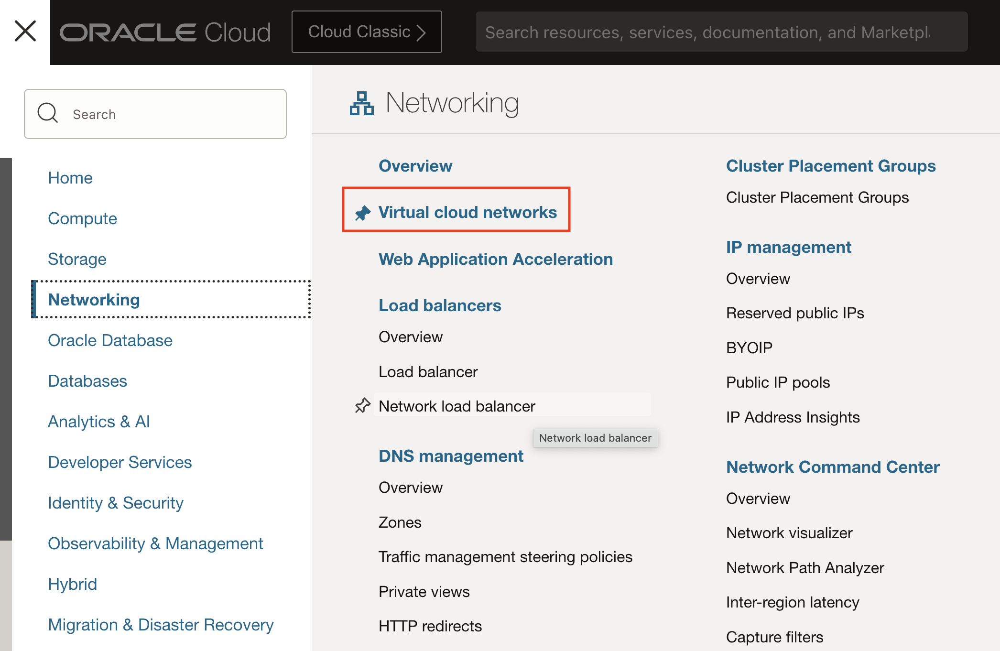
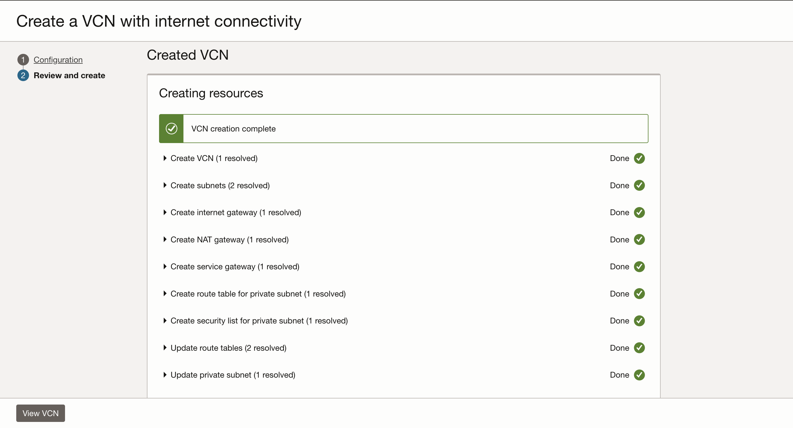
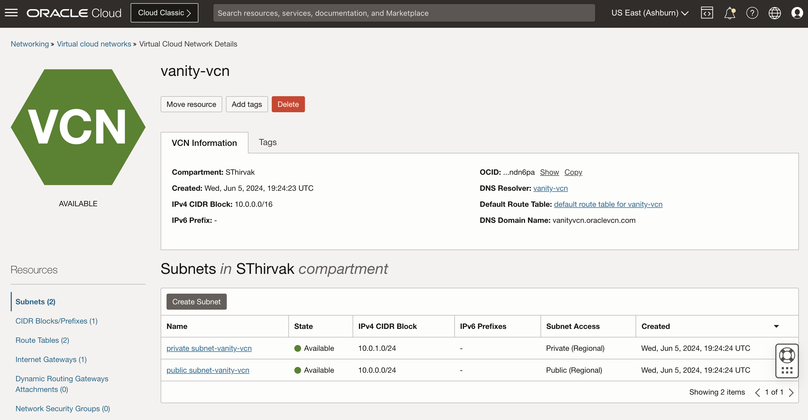
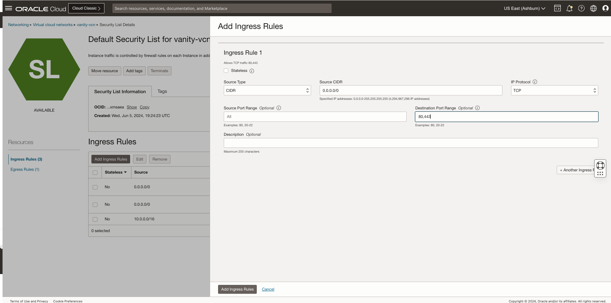

# Prerequisites

## **Introduction**

A vanity URL, also known as a branded URL or custom URL, is a shortened and customized version of a URL that users can enter into their browsers instead of the original URL. The vanity URL automatically redirects users to the original URL's site, but the process is invisible to the user. 

This feature allows a customer to map a custom domain to their Fusion Recruiting Candidate Experience, providing an alternative to the typical Oracle domain. Here is the architecture for this solution: 

In this tutorial, you will learn how to setup Vanity URL leveraging Oracle Cloud Services.

Minimum Requirements: 

Estimated Time: 30 min

## **Configure Virtual Cloud Network**

A virtual cloud network (VCN) is a virtual, private network that closely resembles a traditional network, with firewall rules and specific types of communication gateways that you can choose. You can designate a subnet to exist either in a single availability domain or across an entire region (regional subnets are recommended). 

In this lab, we will configure a Virtual Cloud Network for both API Gateway and OCI Functions. 

1. Click on the navigation on the top left and select virtual cloud network under Networking.

2. Select *Start VCN Wizard > Create VCN with Internet Connectivity*.
3. Enter *VCN name* and select the *compartment name*. Leave everything to default settings. 

4. Review and create a VCN. 

5. Select your public subnet and click *Default security list*. Now add the *ingress rules* as follows: 

*PORT 80 - HTTP, PORT 443 - HTTPS*

## **Generate Auth Token**

To create a new auth token:

1. In the top-right corner of the Console, open the *Profile* menu and then click *User Settings* to view the details.
2. On the Auth Tokens page, click *Generate Token*.
3. Enter a friendly description for the auth token. Avoid entering confidential information.
4. Click *Generate Token*. The new auth token is displayed.
5. Copy the auth token immediately to a secure location from where you can retrieve it later, because you won't see the auth token again in the Console.
6. Close the Generate Token dialog.

## **Summary**

This completes the pre-requisites. 

You may now *proceed to the next lab*.

## **Acknowledgements**

 - **Author** -  Saipriya Thirvakadu | Sr. Cloud Engineer 
 - **Contributors** - Aditya Trivedi | Sr. Cloud Engineer
 - **Last Updated By/Date** - Saipriya Thirvakadu, Sr. Cloud Engineer, June 2024

## See an issue?
Please submit feedback to codeinnovate\_us\_grp@oracle.com. 